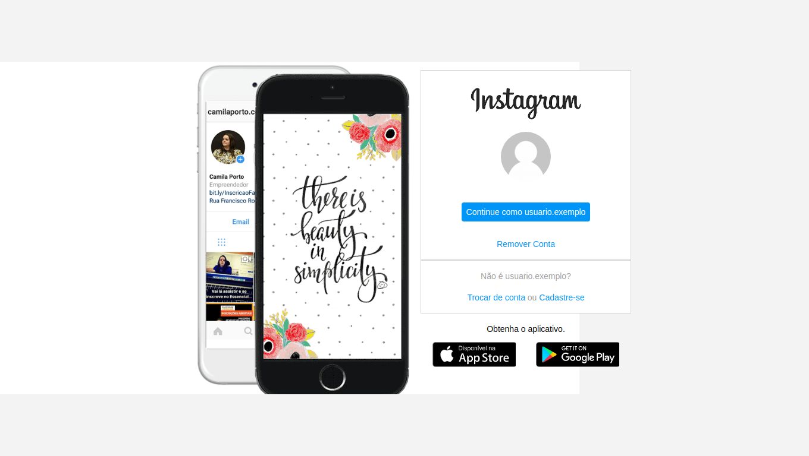

<h1 align="center">Clone Instagram</h1>
<p align="center">
  
</p>

<p align="center">
  Esse projeto foi desenvolvido durante o bootcamp <strong>HTML Web Developer</strong> da plataforma <a href="https://digitalinnovation.one/">Digital Innovation One</a>.
</p>

<p align="center">
  <a href="#technology">Tecnologias</a> | 
  <a href="#c-utilizar">Como Utilizar</a> |
  <a href="#about">About</a> |
  <a href="#license">Licence</a> 
</p>

<h2 id="technology">Tecnologias</h2>
<p>Projeto desenvolvido com as seguintes tecnologias:</p>
<ul>
  <li>HTML5</li>
  <li>CSS3</li>
</ul>

<h2 id="c-utilizar">Como Utilizar</h2>

```
#1 - Clone o repositório
$ git clone https://github.com/ale-mouraboni/instagram-login-page.git

#2 - Abra o index.html
```

<h2 id="about">About</h2>
<p>Um simples clone da tela de Login do Instagram.
</br>
Esse projeto foi desenvolvido durante o bootcamp HTML Web Developer da plataforma Digital Innovation One.
<h4>Responsive?</h4>
[ ] Yes  [x] No
</p>

<h2 id="license">License</h2>
<p>This project is under the MIT license. See the [LICENSE] for more information.
</p>